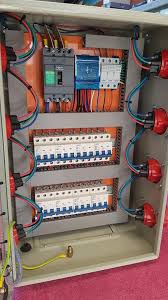

<!DOCTYPE html>
<html lang="es">
<head>
    <meta charset="UTF-8">
    <meta name="viewport" content="width=device-width, initial-scale=1.0">
    <title>Divalfer - Mantenimiento Eléctrico Profesional</title>
    
    <!-- Iconos -->
    <link rel="stylesheet" href="https://cdnjs.cloudflare.com/ajax/libs/font-awesome/6.4.0/css/all.min.css">
</head>
<body>
    <!-- Header y Navegación -->
    <header>
        <nav>
            <a href="#" class="logo">DIVALFER</a>
            

                <a href="#inicio">Inicio</a>
                <a href="#trabajos">Trabajos</a>
                <a href="#clientes">Clientes</a>
                <a href="#contacto">Contacto</a>
            

        </nav>
    </header>

    <!-- Sección Hero -->
    <section class="hero" id="inicio">
        <h1>Mantenimiento Eléctrico Profesional</h1>
        
Soluciones integrales para instalaciones eléctricas residenciales, comerciales e industriales. Seguridad, calidad y eficiencia en cada proyecto.

        <a href="#contacto" class="btn">Solicita tu Presupuesto</a>
    </section>

    <!-- Sección Trabajos Que Realizamos -->
    <section class="section" id="trabajos">
        <h2 class="section-title">Trabajos Realizados</h2>
        

            

                
                

                    <h3>Instalación Eléctrica Residencial</h3>
                    
Montaje completo de cuadros de distribución, toma de corrientes, iluminación y sistemas de protección diferencial en viviendas unifamiliares. Incluye diseño personalizado según necesidades del hogar, cumplimiento de normativas IRAM y pruebas de funcionamiento para garantizar seguridad máxima.

                

            

            

                
                

                    <h3>Mantenimiento Preventivo y Correctivo Industrial</h3>
                    
Inspección periódica de equipos eléctricos, limpieza de instalaciones, reemplazo de componentes desgastados y reparación de fallas en plantas industriales. Se realizan mediciones de tensión, corriente y resistencia, además de informes detallados con recomendaciones para optimizar el rendimiento de los sistemas.

                

            

            

                
                

                    <h3>Renovación de Iluminación Pública</h3>
                    
Cambio de luminarias tradicionales por tecnología LED en calles y plazas, reduciendo consumo energético en un 60%. Incluye ajuste de postes, instalación de controladores temporizados y verificación de conexiones para asegurar durabilidad y eficiencia energética.

                

            

        

    </section>

    <!-- Sección Clientes -->
    <section class="section" id="clientes">
        <h2 class="section-title">Nuestros Clientes</h2>
        

            

                
                
"Contamos con Divalfer para el mantenimiento de nuestras instalaciones desde hace 3 años. Su rapidez en la atención de emergencias y la calidad de sus trabajos son excepcionales."

                
— Empresa Comercial S.A.

            

            

                
                
"Realizaron la instalación completa de mi casa nueva. El equipo fue muy profesional, explicó cada paso y cumplió con los plazos acordados. Muy recomendados."

                
— María López, Residencial

            

            

                
                
"La renovación de nuestro sistema eléctrico redujo nuestros costos de energía y mejoró la seguridad de nuestros trabajadores. El servicio técnico es siempre puntual y eficiente."

                
— Gerente de Planta Industrial

            

        

    </section>

    <!-- Sección Contacto -->
    <section class="section" id="contacto">
        <h2 class="section-title">Contactanos</h2>
        

            
            

                <h3>Estamos listos para ayudarte con tu proyecto eléctrico</h3>
                
<i class="fas fa-envelope"></i> Correo Electrónico: <a href="mailto:Divalfer@gmail.com">Divalfer@gmail.com</a>

                
<i class="fas fa-clock"></i> Horario de Atención Administrativa: Lunes a Viernes de 8:00 a 18:00 hs

                
<i class="fas fa-phone"></i> Consultas Urgentes: WhatsApp 1154584077 o llamada directa 1150038092 

            

        

    </section>
